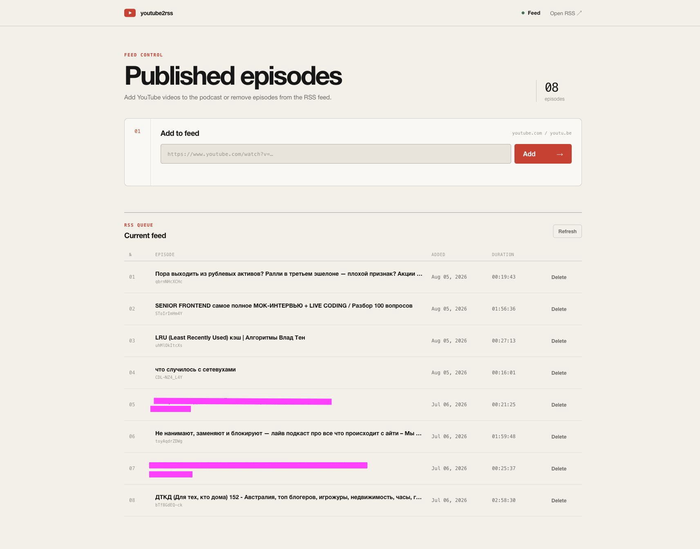

# `youtube2rss`

This Telegram bot allows you to turn YouTube videos into podcast feed that you can listen to in your favorite podcast app. Simply send a YouTube link to the bot and it will download the video, extract the audio, and generate an RSS feed that you can host on your server or use S3 storage.

The bot is built using `Bun` and uses the [youtube-dl-exec](https://www.npmjs.com/package/) library to download and extract the audio from the YouTube videos. It also uses the [podcast](https://www.npmjs.com/package/podcast) library to generate the RSS feed.

To use the bot, you'll need to set up a Telegram bot and get an API token. The runtime is `Bun`; media processing also requires `ffmpeg` and the `yt-dlp` executable installed by `youtube-dl-exec`.

## Installation

1. Clone this repository:

   ```sh
   git clone https://github.com/uqe/youtube2rss
   ```

2. Install dependencies:

   ```sh
   bun install
   ```

3. Create SQLite database:

   ```sh
   bun run prepare
   ```

4. Copy `.env.example` to `.env` or `.env.dev` and fill `TELEGRAM_BOT_TOKEN`, `TELEGRAM_WHITELIST` (comma-separated Telegram user IDs), and `SERVER_URL`. All three values are required. If any S3 variable is set, the complete S3 configuration is required.

5. Start the Telegram bot (**production**):

   ```sh
   bun run start
   ```

   or in **development** mode:

   ```sh
   bun run start:dev
   ```

6. Start the media worker in another terminal:

   ```sh
   bun run worker
   # Development: bun run worker:dev
   ```

   The bot and web server accept jobs; the worker downloads media and publishes feeds. Without a running worker, jobs remain queued.

## How to use

1. Start a chat with your bot in Telegram.

2. Send the bot a YouTube link.

3. The bot will download the video, extract MP3 audio with embedded cover art and YouTube chapters, prepare square episode artwork, and generate an RSS feed. When `yt-dlp` returns chapters, the bot also publishes a Podcasting 2.0 chapter JSON file and references it from the episode RSS item.

4. Host the RSS feed on your server and subscribe to it in your favorite podcast app.

## Bun static file server usage (optional)

1. Start the static file server (**production**):

   ```sh
   bun run serve
   ```

   or **development** mode:

   ```sh
   bun run serve:dev
   ```

## PM2 usage

Start all three production processes (bot, web server, and media worker):

```sh
bun run pm2:start
```

Useful commands:

```sh
bun run pm2:status
bun run pm2:logs
bun run pm2:restart
bun run pm2:stop
```

PM2 file watching is disabled so writing MP3 and RSS files cannot restart the application mid-download.
The worker gets 30 seconds to finish during shutdown; interrupted jobs are recovered on its next start.

## Durable queue and recovery

All downloads, removals, collection membership changes, and RSS rebuilds use a shared SQLite queue.
A transaction claims one job globally, so separate bot and web processes cannot publish concurrently.
The queue and all workers must run on the **same host**, sharing the same SQLite file; owner recovery checks local process IDs.

Jobs survive application restarts. The worker reclaims interrupted jobs after their owner exits and recovers legacy `pending` publications automatically. Failed operations get up to three attempts, with 30- and 60-second delays. The queue preserves submission order during retries. After the final failure, use **Retry** in the activity list or Telegram.

The worker stores Telegram message references, so it can keep updating the same status message after a restart. Download attempts use isolated temporary directories; published files are replaced only after a successful download. RSS files are replaced atomically on the local filesystem.

`bun run build-rss` queues a rebuild and participates in the same worker protocol until that job finishes. It may wait behind existing media jobs.

## Telegram commands and collections

- Send a YouTube link to queue an episode and receive an updating status message.
- `/queue` shows recent jobs.
- `/rss` returns the main subscription URL.
- `/collection Interviews` creates a collection.
- `/collections` lists collection subscription URLs.
- Use **В коллекцию** on a completed episode to add it to a collection, or **Повторить** after a failure.

Collections have stable URLs at `/feeds/<collection-id>.xml`. An episode can belong to several collections while sharing the same audio, artwork, chapters, and RSS GUID. Every episode also remains in the main `/rss.xml` feed. Removing collection membership leaves the episode in the library; deleting an episode removes it from all feeds and storage.

For existing installations, stop the old bot and server before starting the new PM2 configuration. Startup migrates SQLite automatically; the new worker process must be included. Keep a database backup before upgrading. The admin deletion API now returns `202` with a persistent job, rather than waiting for the deletion to finish.

## Development checks

Run formatting, linting, TypeScript validation, and the complete environment-isolated test suite:

```sh
bun run check
```

## Web administration

Set `ADMIN_PASSWORD` in `.env` and restart the static server. Then open:

```text
https://your-server.example/admin
```

Use `admin` as the username and the configured `ADMIN_PASSWORD` as the password. When the variable is empty, the admin page and API return `404` and the public RSS server continues to work normally.



The page shows active RSS episodes, collection filters and subscription links, and persistent job activity. New links are queued immediately; the page can be closed while work continues. Failed jobs and pending publications can be retried from the page. Removing an episode marks it as deleted in SQLite, rebuilds and uploads the RSS feed, and deletes its MP3, episode artwork, and chapter JSON from both the local `public` directory and S3. The database row is preserved.

## S3 file storage usage (optional)

1. Fill env variables: `TELEGRAM_WHITELIST`, `TELEGRAM_BOT_TOKEN`, `SERVER_URL`, `S3_BUCKET`, `S3_ACCESS_KEY`, `S3_ENDPOINT` and `S3_SECRET_KEY` in the `.env` or `.env.dev` file.

If all variables are set, the bot will store `.mp3` files under `files/`, episode artwork under `covers/`, optional Podcasting 2.0 chapter documents under `chapters/`, collection feeds under `feeds/`, and the generated `rss.xml` file in your S3 bucket. I'm using [Cloudflare R2](https://www.cloudflare.com/developer-platform/r2/) as S3 compatible storage. The [free plan](https://developers.cloudflare.com/r2/pricing/) is sufficient for my needs.

## License

This project is licensed under the MIT License. See the [LICENSE](LICENSE) file for details.

## TODO list

- [x] Update README
- [x] Add pm2
- [x] Add structured download logging
- [x] Add thumbnails podcast episodes
- [x] Parse timestamps in video description and add them to the podcast feed
